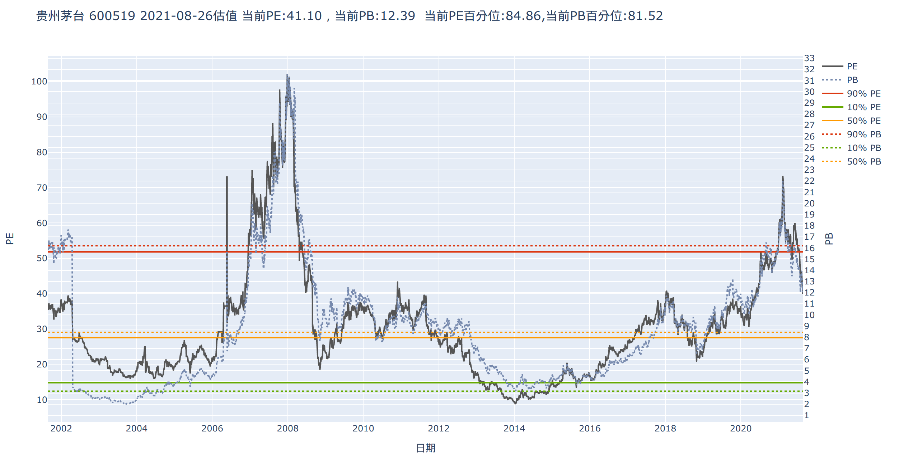
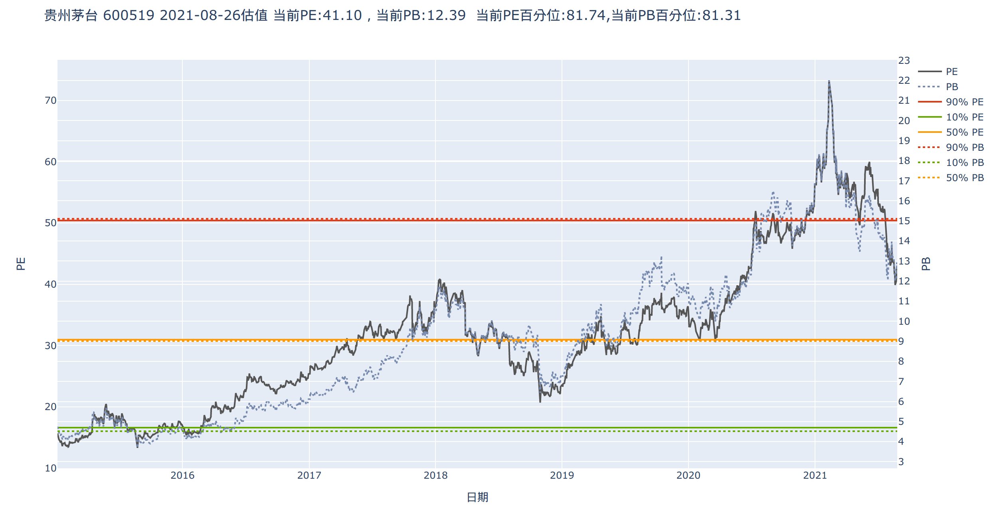
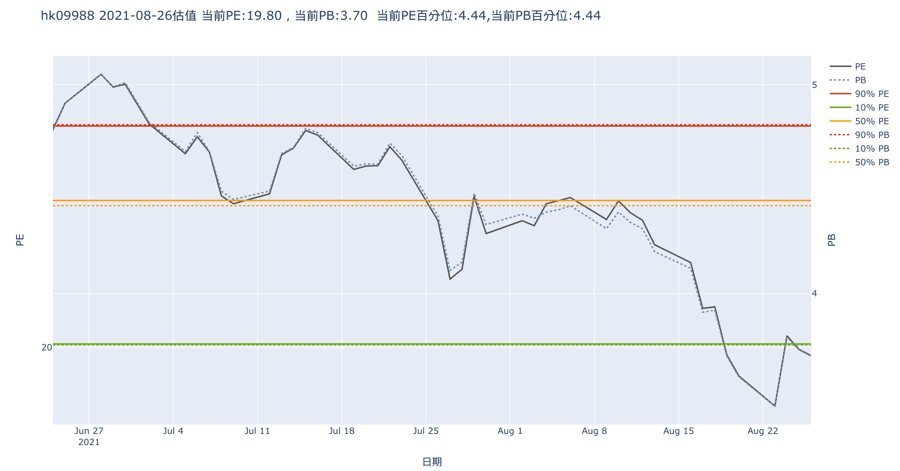
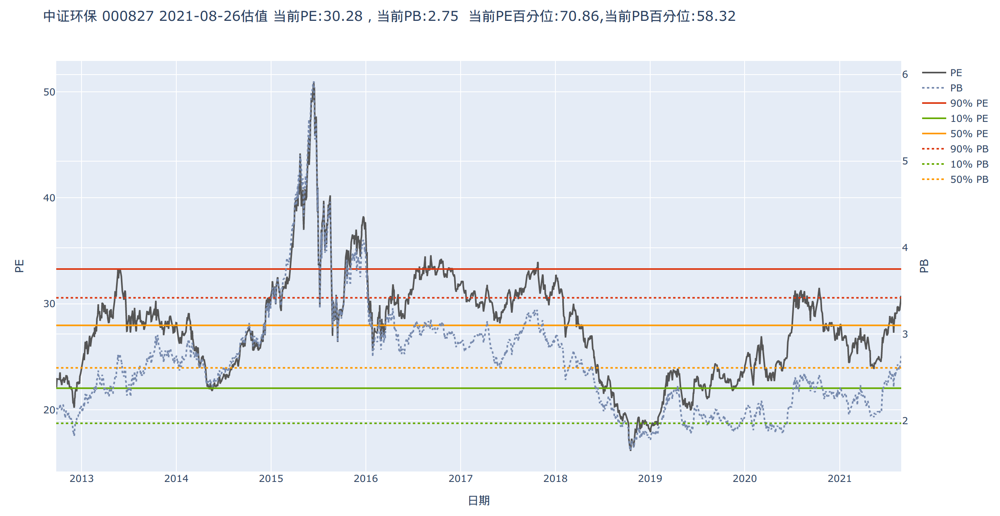
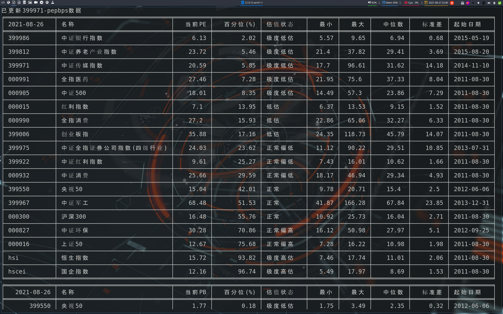
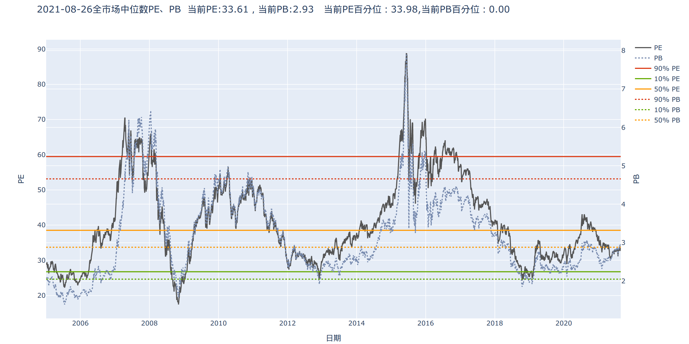

# 指数估值系统

     


利用 [baostock](http://baostock.com/baostock/index.php/%E9%A6%96%E9%A1%B5)和 [akshare](https://github.com/jindaxiang/akshare) 两个免费的金融数据接口获取A股、H股股票交易数据，对 [指数列表](https://www.joinquant.com/data/dict/indexData) 中的指数按等权平均的方式计算平均PE、PB，从而计算出指数的历史百分位和估值状态。

计算方法主要参考“码农滚雪球”在聚宽公开的代码。

## 安装方法

安装好`akshare`，`baostock`，`plotly`等依赖包。

```bash
pip install -r requirement.txt
```

注意最好将`akshare`更新到最新版本：

```bash

pip install akshare -i http://mirrors.aliyun.com/pypi/simple/ --trusted-host=mirrors.aliyun.com  --upgrade
```

## 使用方法

语法：

```python
python calc.py 关键词 [代码] [日期]
```


**关键词**：

* market: 全市场估值
* index: 指数估值
* stock: 个股估值(A股和H股)

其中`代码`和`日期`可选。代码是指股票代码或者指数代码，日期指只筛选大于该日期后的数据。

### 1. A股股票估值

我们以贵州茅台`600519`为例：

```python
python calc.py stock 600519
```



这里采用了python的`plotly`包绘制PE、PB的估值图形，其中实线为PE，虚线为PB，分别给出了历史的90%,50%,10%的分位线。

当我们想只近最近几年的估值情况，我们可以加上日期参数，如我们看2015年以来的估计情况：

```python
python calc.py stock 600519 2015-01-01
```



### 2. H股股票估值

我们以腾讯`hk09988`为例(注意，H股要以`hk`开头)：

```python
python calc.py stock hk09988
```



### 3. 指数估值

可以先在 [聚宽指数列表](https://www.joinquant.com/data/dict/indexData) 中查看你需要的指数代码：

我们以中证环保指数`000827`为例：

```python
python calc.py index 000827
```



同样的我们也可以加日期参数

```python
python calc.py index 000827 2015-01-01
```

来绘制指定日期后的估值情况。

### 4. 自选指数估值

上面是看单个指数估值，我们也可以将平时自己关注的指数加入指数列表。

```python
python calc.py index
```



其中会打印出自选指数PE、PB、PS的历史百分位和估值情况。其中百分位

* [0,10%):极度低估。
* [10%,20%):低估。
* [20%,40%):正常偏低。
* [40%,60%):正常。
* [60%,80%):正常偏高。
* [80%,90%):高估。
* [90%,100%):极度高估。

**添加自选指数方法**

打开`config.json`文件：

```json
{
  "update_date": "2021-08-27",
  "update_date_all": "2021-08-24",
  "path_info": "./basic",
  "path_index": "./index_pepb",
  "path_weight": "./index_weight",
  "path_stock": "./stock",
  "path_market": "./all_market",
  "index_list": [
    "000827",
    "000990",
    "000991",
    "000016",
    "000300",
    "000905",
    "399922",
    "000015",
    "000932",
    "399967",
    "399006",
    "399986",
    "399975",
    "399550",
    "399812",
    "399971"
  ]
}
```

在`index_list`中添加或者删除指数代码。程序在运行`python calc.py index`时会自动读取`index_list`中的指数列表，获取对应成份股股票，并计算等权PE、PB。


### 5. 全市场估值

```python
python calc.py market
```



## 关于运行时间

获取股票数据采用的单进程（多进程频率过高将调用接口失败），计算指数等权PE\PB时采用的多进程计算。

首次运行自选指数估值时，由于需要获取的股票数据较多，可能会比较慢，需要几十分钟或一个多小时。

计算单个指数、或者股票数据时较快。

全市场估值不用计算，获取的现成值，也较快。


## 福利

我和广发证券合作，他们给出了比较优惠的开户佣金：

ETF基金万0.5，免5元手续费。

股票万1.2。

有需要的朋友可以通过按下面我的公众号文章开户。

[万0.5超低佣金开户](https://mp.weixin.qq.com/s/JeAkfTqmzBQnCBU95km-dw) 
